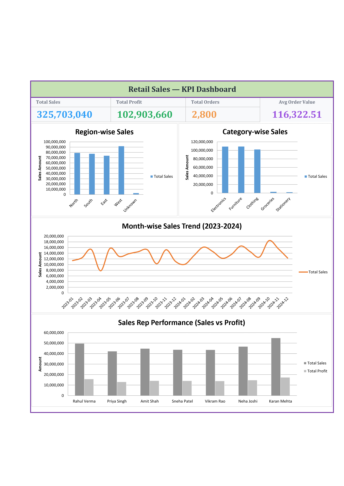

# KPI Dashboard Development — MS Excel

## Overview
An interactive retail sales KPI dashboard built in Excel, covering data cleaning, formula-driven summary tables, and visual reporting — from a raw, inconsistent dataset (2,800 records) to a business-ready dashboard.

## Tools Used
- MS Excel (Power Query, Advanced Formulas, Charts)

## What's Inside

| File | Description |
|---|---|
| `KPI_Dashboard_Retail_Sales.xlsx` | The complete workbook — raw data, cleaned columns, summary tables, and dashboard |
| `retail_sales_raw_data.xlsx` | The original raw dataset before cleaning (for reference) |

## Workflow

**1. Data Cleaning (Power Query)**
- Imported raw sales data (2,800 records) via Power Query
- Removed duplicate rows
- Trimmed extra whitespace and standardized text casing across Region, Category, and Sales Rep fields

**2. Data Quality Fixes (Advanced Formulas)**
- Identified and fixed inconsistent category naming that case-cleaning alone couldn't catch (e.g., "Cloth" vs "Clothing", "Electronic" vs "Electronics") using nested `IF` formulas for exact-match correction
- Handled blank Region values by classifying them as "Unknown" instead of dropping data, to keep totals accurate
- Built cleaned helper columns (`Region_Clean`, `Category_Clean`, `OrderMonth`, `SalesRep_Clean`) that stay live and update automatically if source data changes

**3. Summary Tables (SUMIFS)**
- Region-wise sales summary
- Category-wise sales summary
- Month-wise sales trend (2023–2024)
- Sales Rep performance (sales + profit)

**4. Dashboard**
- 4 KPI cards: Total Sales, Total Profit, Total Orders, Average Order Value
- 4 charts: Region-wise sales, Category-wise sales, Month-wise trend, Sales Rep performance comparison

## Key Skills Demonstrated
- Power Query for data import and initial cleaning
- Advanced formulas (`SUMIFS`, `IF`, `PROPER`, `TRIM`, `TEXT`) for dynamic, live-updating summaries
- Data quality auditing — catching issues that simple cleaning steps miss
- Dashboard design with KPI cards and charts for business reporting

## Sample Output

## How to Use
1. Open `KPI_Dashboard_Retail_Sales.xlsx` in Excel
2. Explore the `RawSalesData` sheet to see the cleaned helper columns and formulas
3. Check `RegionSummary`, `CategorySummary`, `MonthlyTrend`, and `SalesRepSummary` sheets for the underlying calculations
4. View the `DashBoard` sheet for the final KPI cards and charts
